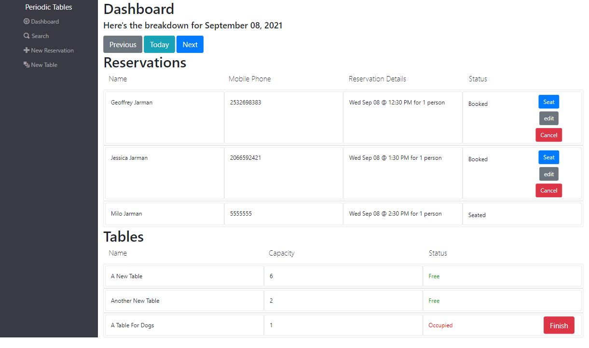
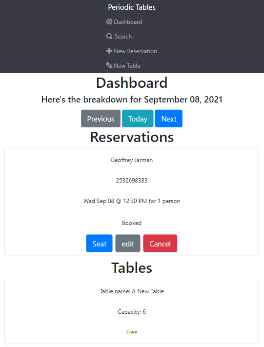
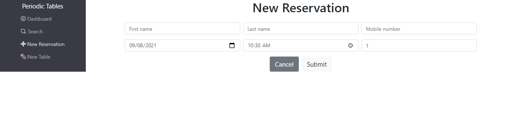
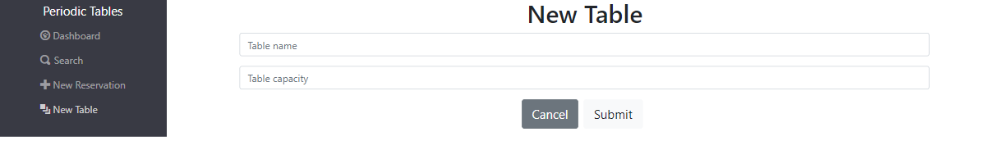
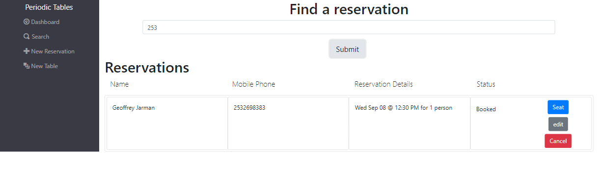

# Periodic Tables - A Restaurant Reservation System

# Dashboard - Web



# Dashboard - Mobile



# New Reservation Page



# New Table Page



# Search Page 



# API

## GET
### /reservations?date={someDate}
the date must be formatted yyyy-MM-dd  
returns a list of reservations with matching date  
*Dashboard does not display 'finished' reservations but search does*  
### /reservations?mobile_number={someNumber}
Search is very lenient and will return all reservations with any matching numbers in part of mobile_number  
Empty search returns all reservations
### /reservations/:reservation_id
returns reservation with matching id
### /tables
Lists all tables
## POST
### /reservations
body must be formatted as such and include all fields shown  
```
{
    first_name: "name",
    last_name: "lastName",
    mobile_number: "1231231234",
    reservation_date: "2021-04-20",
    reservation_time: "11:30",
    people: 1,
}
```
reservation_id automatically generated  
status defaults to booked and must be set to booked upon creation  
people must be a non-negative integer
### /tables
body must be formatted as such and include all fields shown  
```
{
    table_name: "name",
    capacity: 1
}
```
table_name must be at least 2 characters  
capacity must be a non-negative integer  
reservation_id is a foriegn key defaulted to null
## PUT
### /reservations/:reservation_id
must include all of the fields from POST  
if status is currently 'finished' PUT will fail  
### /reservations/:reservation_id/status
Request body only needs a status, but still finished reservations cannot be updated
### /tables/:table_id/seat
knex transaction that updates reservation.status and table.reservation_id  
UPDATE IS USED FOR SEATING - DELETE IS ALSO AN UPDATE THAT FINISHED THE RESERVATION  
## DELETE
### /tables/:table_id/seat
knex transaction that updates reservation.status and table.reservation_id  
sets table.reservation_id to null and reservation.status to finished
## FRONT-END ROUTES
Routes are self explanatory and intuitively connected to the api  
* /dashboard  
* /search  
* /tables/new  
* /reservations/new  
* /reservations/:reservation_id/seat
* /reservations/:reservation_id/edit

# Technology Used
Front-end -> React, Twitter Bootstrap  
Back-end -> Node, Express, Knex  
Database -> Postgres, ElephantSQL  

# Installation
Fork and clone this repo  
Run `npm install` in the main directory  
cd back-end/ and run `npm install`  
cd front-end/ and run `npm install`  
create a .env file in each repo and add the following info  
* back-end
```
DATABASE_URL_DEVELOPMENT=development-data-base-url-goes-here
DATABASE_URL_TEST=test-data-base-url-goes-here
```
* front-end  
```
REACT_APP_API_BASE_URL=http://localhost:5000
```
Open a terminal navigated to the back-end/
Run `knex migrate:latest`  
Run `knex seed:run`
Run `npm run start`  
Open a terminal navigated to the front-end/
Run `npm run start`
